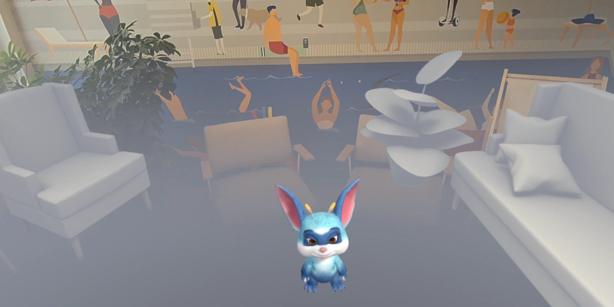
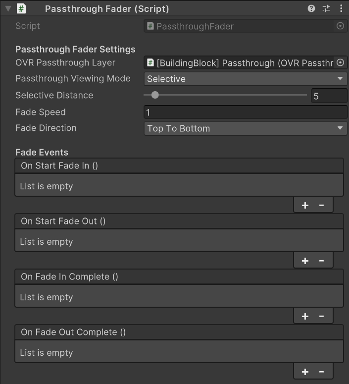
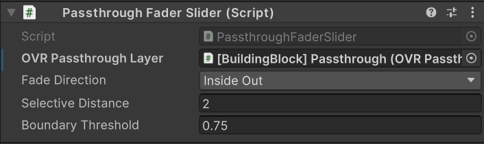
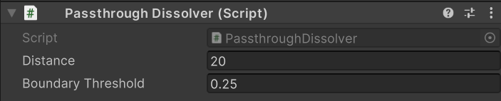

# MR Motifs - Compelling Mixed Reality Uses Cases

# Project Overview

Motifs are blueprints for recurring ideas which we expect, and have observed, our community to build. They are not full applications, but rather recurring aspects of applications, which may require a collection of technical features and APIs to be achieved. With MR Motifs we would like to teach MR best practices, inspire developers and spark new ideas. Our goal is to stop developers from having to reinvent the wheel by providing them with a solid baseline for popular mechanics, which we frequently observe.

You can find even more tips and tricks on [how to design Mixed Reality experiences](https://developer.oculus.com/resources/mr-overview/) in our [Developer Resources](https://developer.oculus.com/resources/)!

# Requirements

- Recommended Unity version: 2022.3 LTS (Project is currently on 2022.3.38f1)
- Mac or Windows
- BiRP or URP
- Meta XR Core SDK (67.0.0)
- Meta XR Interaction SDK (67.0.1)
- Meta XR Interaction SDK Essentials (67.0.0)
- Meta XR SDK Shared Assets (67.0.0.)

# MR Motifs Library

- [Passthrough Transitioning](#passthrough-transitioning)
- [Motif #2](#motif-2) (Coming Soon)

> [!IMPORTANT]
> All scenes in the [MR Motifs folder](./Assets/_MRMotifs/) can be loaded from the [MRMotifsHome](./Assets/_MRMotifs/MRMotifsHome.unity) scene which contains the UI Panel [prefab](./Assets/_MRMotifs/_Shared/Prefabs/UI%20Panel.prefab) and [script](./Assets/_MRMotifs/_Shared/Scripts/UIPanel.cs), which holds a list of all the other scenes and which controls (Buttons, Toggle, Sliders, etc.) belong to them. If you are opening any scene in the project and would like to test it without starting from the MRMotifsHome scene simply make sure that beforehand you enable the existing panels or controls that we added to the scene but disabled by default or add a UI Panel prefab to your scene!

## Passthrough Transitioning

With this Motif we would like to show the transitioning from fully immersive experiences, to mixed reality experiences using [passthrough](https://developer.oculus.com/documentation/unity/unity-passthrough/) as their background and vice-versa. We want to address what passthrough is, where and how it can and should be used, and how to fade between MR and VR mode. With this project you will be able to adjust the visibility of your surroundings by manipulating a slider, which regulates the level of passthrough, or directly switch from one mode to another by the press of a button.

We fade between VR and passthrough by setting a sphere as the child of our main camera. We manipulate the sphere by using a shader which we control at runtime with a custom script. This allows us to achieve different capabilities such as adjusting fade speed, fade direction, fade distance and even effects like dissolving the sphere in a random pattern. Read more to find out how you can use this in your project!

> [!NOTE]
> We also show you how to use the [Boundary API](https://developer.oculus.com/documentation/unity/unity-boundaryless/), to disable the guardian while we are in passthrough!

### Get started

- Find all resources in the [Passthrough Transitioning folder](./Assets/_MRMotifs/PassthroughTransitioning/)
- Make sure to have an OVR Camera Rig with OVR Manager and support passthrough
- Make sure to enable insight passthrough on the OVR Manager
- Use an OVR Passthrough Layer on Underlay
- Add the Passthrough Fader prefab to the centercamera and reference the OVR Passthrough Layer on the [Passthrough Fader component](./Assets/_MRMotifs/PassthroughTransitioning/_Samples/Scripts/PassthroughFader.cs)
- Have a way to call the TogglePassthrough method of the PassthroughFader component. You can use the Controller Buttons Mapper Building Block or the [UI Panel prefab](./Assets/_MRMotifs/_Shared/Prefabs/UI%20Panel.prefab)

### Contextual Passthrough

[Contextual passthrough](https://developer.oculus.com/documentation/unity/unity-customize-passthrough-loading-screens/#configuring-system-splash-screen) means if passthrough should be enabled based on [system recommendation](https://developer.oculus.com/documentation/unity/unity-passthrough-gs/#enable-based-on-system-recommendation). In other words, if the user is in passthrough mode in his home environment, our operating system can detect this and display the system splash screen as well as our Unity scene in passthrough as well. In VR mode, the system splash screen will be shown with a black background like before.

> [!IMPORTANT]
> Currently Passthrough (Contextual) for the system splash screen can currently only be enabled with a Unity Pro license.

|                  Splash Screen (Black)                       |               Splash Screen (Passthrough Contextual)         |
| :----------------------------------------------------------: | :----------------------------------------------------------: |
|        |        |

> [!TIP]
> If you enabled Passthrough (Contextual) and can still not see the effect being applied, make sure to update your AndroidManifest.xml. For this you need to go to “Meta” then “Tools” and then update the Android Manifest file.

### Conditional Passthrough

An additional way of using passthrough is to use it for being able to switch between MR and VR game modes, or to conditionally switch to passthrough e.g. when opening the menu, double tapping on the device, changing scenes, or to conditionally fade in and out certain parts of the experience, such as a keyboard, screen, wall, or ceiling. All these use cases require a way to switch between fully immersive VR and passthrough conditionally on user-command. Showing the whole environment or parts of it at all or carefully selected times, can invoke a sense of comfort and immersion for the player and lead to players staying in the experience for longer periods of time.

Keep in mind that enabling passthrough is asynchronous. System resources like cameras can take a few hundred milliseconds to activate, during which time passthrough is not yet rendered by the system. This can lead to a black flicker if your app expects passthrough to be visible immediately upon enabling. You can avoid that by using the [PassthroughLayerResumed](https://developer.oculus.com/documentation/unity/unity-passthrough-gs/#wait-until-passthrough-is-ready) event, which is emitted once the layer is fully initialized and passthrough is visible. Additionally, we don’t just want to immediately go from passthrough to VR but rather use a [shader](./Assets/_MRMotifs/PassthroughTransitioning/Shaders/PassthroughFader.shader) to smoothly transition between the two. Below are several sample scenes that help you get started!

### Main components

#### PassthroughFader Script

The [PassthroughFader](./Assets/_MRMotifs/PassthroughTransitioning/_Samples/Scripts/PassthroughFader.cs) script is a component that contains both Underlay and Selective passthrough modes and lets the user decide which to use in the inspector. You will be fine just using this one script and setting your desired mode, instead of the separate [PassthroughFaderUnderlay](./Assets/_MRMotifs/PassthroughTransitioning/Scripts/PassthroughFaderUnderlay.cs) and [PassthroughFaderSelective](./Assets/_MRMotifs/PassthroughTransitioning/_Samples/Scripts/PassthroughFaderSelective.cs.meta) scripts. The PassthroughFader as well as the PassthroughFaderSelective scritps live in the [Samples folder](./Assets/_MRMotifs/PassthroughTransitioning/_Samples/Scripts/) while the PassthroughFaderUnderlay script is in the [main folder](./Assets/_MRMotifs/PassthroughTransitioning/Scripts/), since we use it in the [video tutorial](https://www.youtube.com/@MetaDevelopers).

|                  PassthroughFaderUnderlay                    |                  PassthroughFaderSelective                   |
| :----------------------------------------------------------: | :----------------------------------------------------------: |
| ||

On the PassthroughFader component we can assign our OVR Passthrough Layer as well as adjust Fade Speed and Fade Direction. Here we can addtionally change the Passthrough Viewing Mode as well as the Selective Distance, which is only relevant when using the Selective Passthrough mode. This distance allows us to only show virtual content up until a predefined distance when in Passthrough. This can be useful for use cases like table top games or interaction where the user needs to be especially focussed on their surrounding. The PassthroughFader comes with four Unity Events that will inform us when a fade-out and fade-in was started and completed. This comes in handy when you want to e.g. play an audio clip whenever either of those events are invoked.

This script shows you how to check if [passthrough is recommended](https://developer.oculus.com/documentation/unity/unity-passthrough-gs/#enable-based-on-system-recommendation), [wait until passthrough is ready](https://developer.oculus.com/documentation/unity/unity-passthrough-gs/#wait-until-passthrough-is-ready), and how to toggle between VR and passthrough smoothly in the [PassthroughToggle method](./Assets/_MRMotifs/PassthroughTransitioning/_Samples/Scripts/PassthroughFader.cs#L196).

#### PassthroughFaderSlider Script

Additionally, we prepared a [PassthroughFaderSlider](./Assets/_MRMotifs/PassthroughTransitioning/Scripts/PassthroughFaderSlider.cs) script, that has mostly the same logic as the PassthroughFader above but allows you to slowly fade between VR and Passthrough manually, using a slider. Furthermore, here we show you how to turn of the guardian when in passthrough. The PassthroughFaderSlider also allows us to adjust the selective distance as we did in the PassthroughFaderSelective.

#### PassthroughDissolver Script

The [PassthroughDissolver](./Assets/_MRMotifs/PassthroughTransitioning/_Samples/Scripts/PassthroughDissolver.cs) works very similarly to the [PassthroughFaderSlider](./Assets/_MRMotifs/PassthroughTransitioning/Scripts/PassthroughFaderSlider.cs), with the exception that we don't adjust the inverted alpha value with our slider but the dissolve level instead.

#### Other scripts

Other scripts that are part of the Passthrough Transitioning samples are the [AudioController](./Assets/_MRMotifs/PassthroughTransitioning/_Samples/Scripts/AudioController.cs), which is responsible for reading the inverted alpha value from the material and adjusting the volume accordingly, as well as the [PerlinNoiseTexture](./Assets/_MRMotifs/PassthroughTransitioning/_Samples/Scripts/PerlinNoiseTexture.cs), which generates a texture for our PassthroughDissolver shader. With the [Perlin Noise](https://docs.unity3d.com/ScriptReference/Mathf.PerlinNoise.html) settings we can therefore create many unique dissolve effects without bloating our project with many different textures.

### Shaders

#### PassthroughFader HLSL

The Passthrough Transitioning utilizes a shader to achieve a smooth fading between VR and passthrough. The shader used by the Passthrough Fader and Slider is the [PassthroughFader](./Assets/_MRMotifs/PassthroughTransitioning/Shaders/PassthroughFader.shader) HLSL shader. The fragment shader handles fading effects by adjusting the alpha channel of the texture based on the specified fade direction and inverted alpha value. The _InvertedAlpha parameter inverts the alpha transparency, creating a dissolve effect, while the _FadeDirection parameter controls the direction of the fade. The _FadeDirection modifies the alpha value by interpolating based on the UV coordinates: direction 0 uses the red channel, 1 fades from right to left, 2 fades from top to bottom, and 3 fades from the center outwards, with all transitions smoothed by smoothstep. The PassthroughFader as well as the PassthroughFaderSlider can directly access and modify the inverted alpha value and fade direction.

> [!IMPORTANT]
> Since we are inside a sphere where we apply this shader to, we need to make sure to turn cullign off (Cull Off). Also, make sure to keep the render queue at Transparent-1 (2999) to render behind transparent and opaque materials to prevent z-fighting (flickering).

#### PassthroughDissolver HLSL & ShaderGraph

For you to not only fade between VR and passthrough but also achieve a fancy effect we included the [PassthroughFaderDissolve](./Assets/_MRMotifs/PassthroughTransitioning/_Samples/Scenes/PassthroughFaderDissolve.unity) scene which uses the [PassthroughDissolver](./Assets/_MRMotifs/PassthroughTransitioning/_Samples/Scripts/PassthroughDissolver.cs) script to manipulate either the [PassthroughDissolver](./Assets/_MRMotifs/PassthroughTransitioning/_Samples/Shaders/PassthroughDissolver.shader) or the [PassthroughDissolverSG](./Assets/_MRMotifs/PassthroughTransitioning/_Samples/Shaders/PassthroughDissolverSG.shadergraph) shader material and adjusts the level of dissolution to reveal passthrough in a pattern. The pattern in the case of [PassthroughDissolver](./Assets/_MRMotifs/PassthroughTransitioning/_Samples/Shaders/PassthroughDissolver.shader) comes from the [PerlinNoiseTexture](./Assets/_MRMotifs/PassthroughTransitioning/_Samples/Scripts/PerlinNoiseTexture.cs) script. For the [PassthroughDissolverSG](./Assets/_MRMotifs/PassthroughTransitioning/_Samples/Shaders/PassthroughDissolverSG.shadergraph) shader the texture is generated already inside the ShaderGraph.

### Sample Scenes

#### PassthroughFaderUnderlay

The passthrough fader underlay scene is located in the scenes and comes with a PassthroughFaderUnderlay prefab, which is located on the centerEyeAnchor. It contains the PassthroughFaderUnderlay component. The prefab also contains an audio source, that is used to play audio clips whenever we fade in or out.

#### PassthroughFaderSelective

The passthrough fader selective scene is located in the sample scenes and similarly to the PassthroughFaderUnderlay above comes with a PassthroughFaderSelective prefab, which is located on the centerEyeAnchor. It contains the PassthroughFaderSelective component. The prefab also contains an audio source, that is used to play audio clips whenever we fade in or out.

#### PassthroughFaderSlider

The passthrough fader slider scene is located in the scenes and comes with a PassthroughFaderSlider prefab, which is located on the centerEyeAnchor. It contains the PassthroughFaderSlider component.

#### PassthroughFaderDissolve

|                  PassthroughFaderDissolve                    |                  PassthroughFaderDissolveSG                  |
| :----------------------------------------------------------: | :----------------------------------------------------------: |
|      |  |

The passthrough fader slider scene is located in the sample scenes and comes with a PassthroughDissolver prefab, which is located outside the centerEyeAnchor, so that the dissolution pattern does not move with our head but instead stay anchored in the scene. It contains the PassthroughDissolver component. By default we applied the PassthroughDissolver shader to the sphere, therefore we need the PerlinNoiseTexture script to generate a texture for us, which we can easily modify by changing the values in the inspector. If you were to use the PassthroughDissolverSG ShaderGraph shader, you can simply remove the PerlinNoiseTexture component since the texture is already generated within the ShaderGraph, everything else works the same.

## Motif #2

Coming Soon!

# Health and safety guidelines

When building mixed reality experiences, we highly recommend evaluating your
content from a health and safety perspective to offer your users a comfortable
and safe experience. Please read the
[Mixed Reality H&S Guidelines](https://developer.oculus.com/resources/mr-health-safety-guideline/)
before designing and developing your app using this sample project, or any of
our Presence Platform features.

Developers should avoid improper occlusion, which occurs when virtual content
does not respect the physicality of the user’s environment. Improper Occlusion
can result in a misperception of actionable space.

- See
  [Occlusions with Virtual Content](https://developer.oculus.com/resources/mr-health-safety-guideline/#passthrough)

- To avoid improper occlusion, developers should ensure that users have (1)
  completed Space Setup and (2) granted Spatial Data permission (setup design)
  to allow proper occlusion in content placement, mesh collisions, and air
  navigation.

Using semi-transparent content lets the user have a better view of their
physical space and reduces the occlusion of objects or people that are not part
of the scanned mesh.

- Spatial data won’t incorporate dynamic elements of a user’s living space (for
  example, a chair that was moved after capture or a moving person/pet in the
  space).

- Uncaptured dynamic elements may be occluded by virtual content, making it more
  difficult for a user to safely avoid such hazards while engaged in the mixed
  reality experience.

Respect the user’s personal space. Avoid having virtual content pass through
their body or loom close to their face. When content crosses into a user’s
personal space they may experience a psychological or visual discomfort, or take
actions to avoid the virtual content that may increase the risk of injury or
damage (for example, backing up into a wall or chair). Dynamic virtual content
may also distract the user from their surroundings.

# License

This codebase is available as both a reference and a template for mixed reality
projects. The [Meta License](./LICENSE) applies to the SDK and supporting
material. The MIT License applies to only certain, clearly marked documents. If
an individual file does not indicate which license it is subject to, then the
Oculus License applies.

See the [CONTRIBUTING](./CONTRIBUTING.md) file for how to help out.
